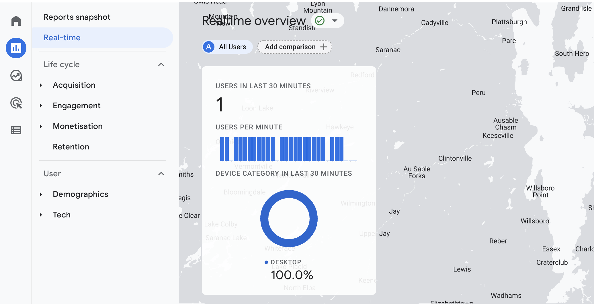

With more visitors coming into your website, you will need to add different third party scripts to your project that will provide functionality beyond the core functionality of your website.

The most common third party scripts are Google Analytics and Facebook Pixel which are web analytics services that will help you assess and improve the effectiveness of your website.

In this guide, we will learn how to add google analytics to your Astro project using a web worker with Partytown.

## 🧑‍💻 Getting started

Create a new Astro project with the CLI

```bash
npm create astro@latest
```

Install the Astro integration for Partytown:

```bash
npm install -D @astrojs/partytown
```

Add the partytown integration to your `astro.config.mjs` with the following config options.

```js title="astro.config.mjs"
import { defineConfig } from "astro/config";
import partytown from "@astrojs/partytown";

export default defineConfig({
  integrations: [
    partytown({
      // Adds dataLayer.push as a forwarding-event.
      config: {
        forward: ["dataLayer.push"],
      },
    }),
  ],
});
```

This configuration allows Partytown to forward all events to Google Analytics using `window.dataLayer`. You can find more information about configuration options in the [Partytown documentation](https://partytown.builder.io/google-tag-manager#forward-events).

Create a google analytics account and get the tracking ID. After creating a new property for your domain, you can find the tracking ID in the **Property Settings**.


## 👩‍🚀 Hands-on time!

Now that we have the partytown integration installed and our google analytics tracking ID, we can start setting up our google analytics script.

Google Analytics will provide your with an inline script that will be very similar to the following one:

```html
<!-- Global site tag (gtag.js) - Google Analytics -->
<script
  async
  src="https://www.googletagmanager.com/gtag/js?id=GA_MEASUREMENT_ID"
></script>
<script>
  window.dataLayer = window.dataLayer || [];
  function gtag() {
    window.dataLayer.push(arguments);
  }
  gtag("js", new Date());
  gtag("config", "GA_MEASUREMENT_ID");
</script>
```

Modify the script above to allow partytown to run google analytics in a web worker.

1. Replace the `GA_MEASUREMENT_ID` with your own tracking ID.
2. Add a `type` attribute and set it to `text/partytown` to both scripts. This tells partytown which script tags to handle.

Our new script will look like this after all the modifications:

```astro title="Layout.astro"
<!-- head -->
<script
  type="text/partytown"
  src="https://www.googletagmanager.com/gtag/js?id=GA_MEASUREMENT_ID">
</script>
<script type="text/partytown">
  window.dataLayer = window.dataLayer || [];
  function gtag() {
    dataLayer.push(arguments);
  }
  gtag("js", new Date());
  gtag("config", "GA_MEASUREMENT_ID");
</script>
<!-- more head -->
```

Finally, place this code snippet in the head of your html. If you are coping the code above do not forget to update your `GA_MEASUREMENT_ID`.

Congratulations, you have successfully added google analytics to your Astro project 🎉!

## Testing 👩‍🔬

After deploying your project, go to your google analytics real time dashboard. You should see some recent activity after visiting your website.


